Руководство.

Я постарался выполнить основное задание, а также два дополнительных. В работе старался придерживаться указанных функциональных и нефункциональных требований

Что использовалось при работе:

VS Community 2026
VSCode
Java Script
React
.Net 10
Node js 24.14.0 (npm 11.9.0)
xunit

Чтобы запустить приложение, необходимо разархивировать проект.

Для бэкенда:
открыть решение (.sln) через VS (внутри RadustovTestTask),
назначить в качестве запускаемого проекта RadustovTestTask.API
Чтобы выполнить миграцию, откройте консоль диспетчера пакетов, введите следующие команды:
Add-Migration InitialMigration
Update-Database

После чего через IDE запустите приложение (localhost:5224)

В проекте бэкенда RadustovTestTask.API откройте файл appsettings.json, в нем можно найти почту и пароль для роли руководителя.

Для фронтенда

открыть папку radustovtesttaskfrontend через VSCode

установить node.js

npm install 
npm start  

фронтенд запускается на localhost:3000.

перейдите в браузере на localhost:3000, попадете на форму авторизации.
Введите в поле Email почту, в поле Password пароль и нажмите на кнопку Login
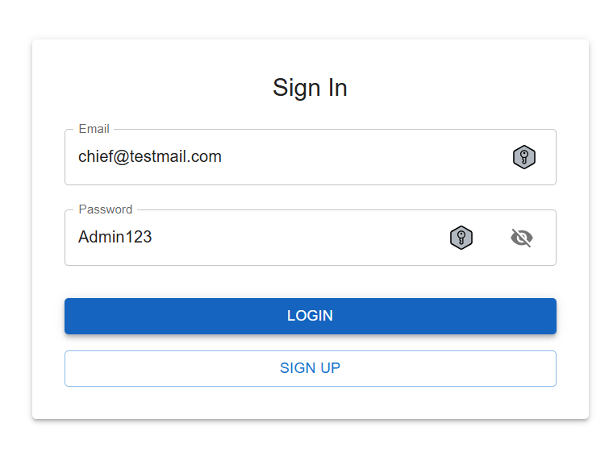

После чего попадете на главную страницу приложения
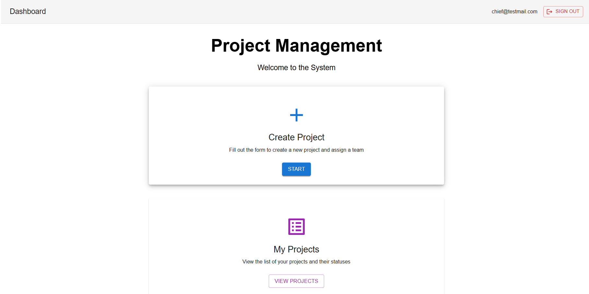

В правом верхнем углу кнопка для выхода из системы.

В начале необходимо пролистать вниз до вкладки Employees и нажать на нее.
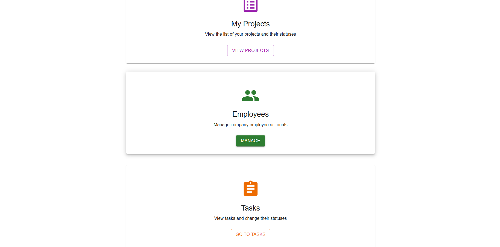

Во вкладке Employees ввести данные работника и выдать ему роль Employee, запомнить его почту и пароль.

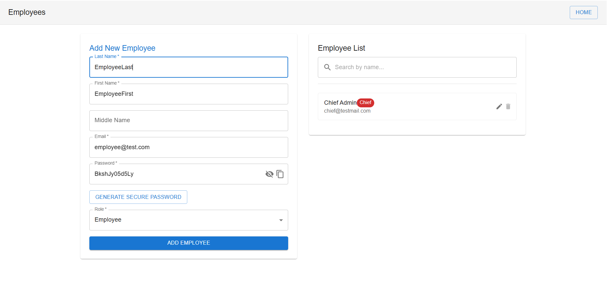

Повторить процедуру для менеджера.

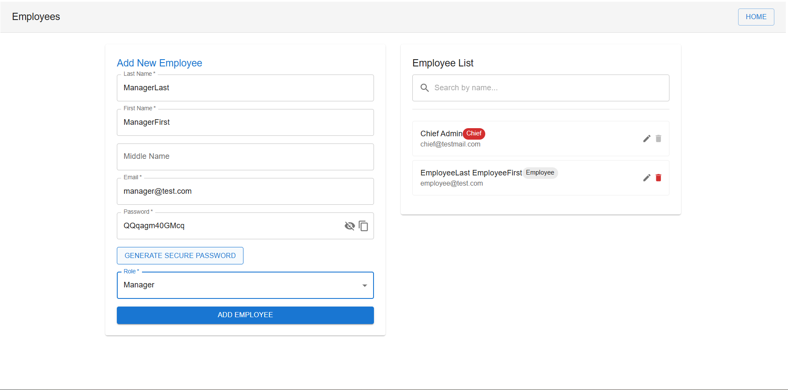

После чего нажать на кнопку Home в правом верхнем углу и перейти в основную вкладку.

Далее нажать на карточку CreateProject и перейти в 1 шаг визарда. Добавить имя проекта, даты и приоритет. Нажать на кнопку next и перейти во 2 шаг визарда.
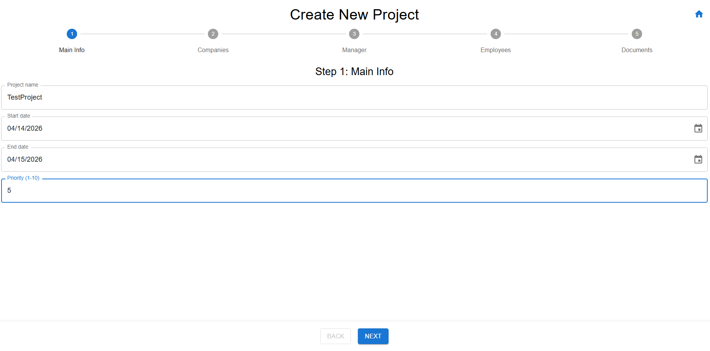

Во втором шаге добавить компанию-заказчика и компанию-исполнителя.

Перейти к 3 шагу, выбрать менеджера

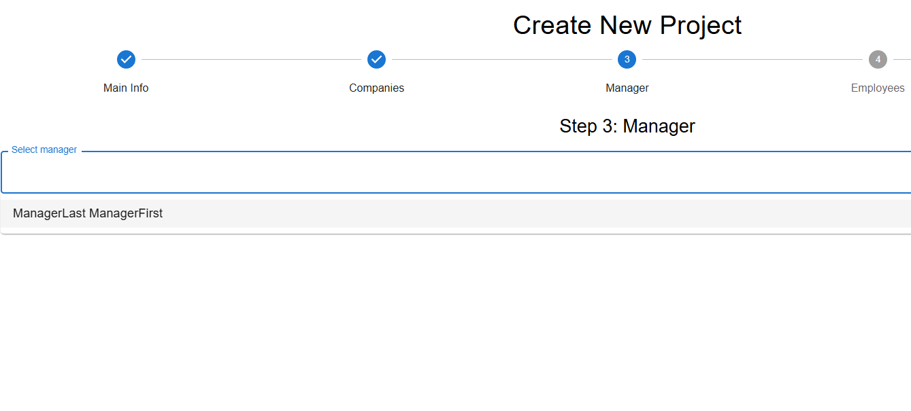

Перейти к 4 шагу, выбрать работника

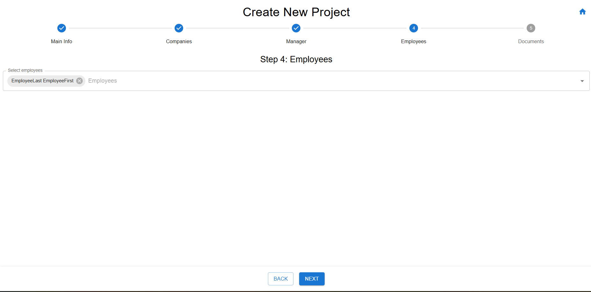

Перейти к 5 шагу и загрузить какое-нибудь прилагаемое изображение. 

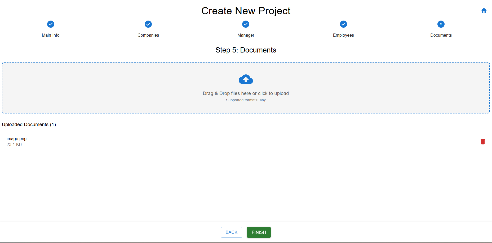

Далее нажать на finish, перейти в следующую форму, нажать go to home.
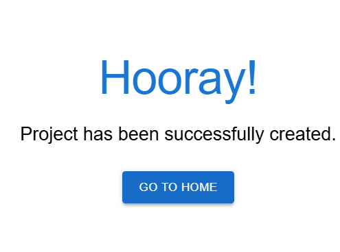

После чего можно нажать на карточку Projects и посмотреть на созданный проект. Если проектов много, то можно использовать фильтры для нахождения нужного.

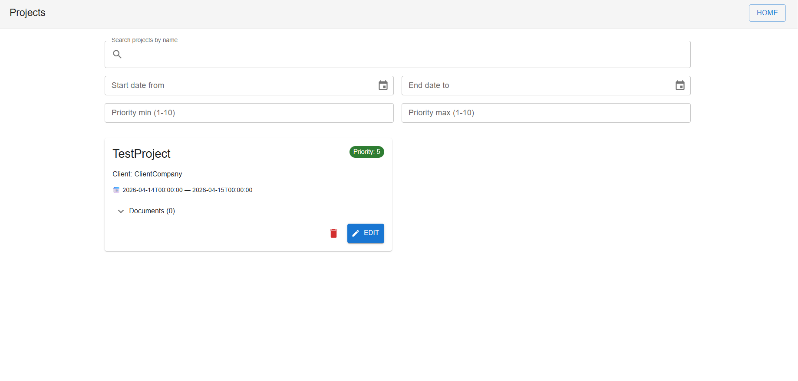

Также из главной страницы можно перейти к задачам, нажав на карточку Tasks. После чего нажать на кнопку + New Task, заполнить данные и нажать на Create Task

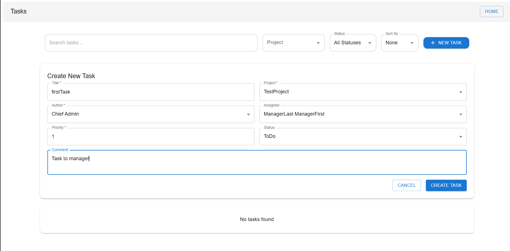

Теперь можно увидеть карточку созданной задачи. Ее можно редактировать. В случае если задач много, можно воспользоваться поиском и фильтрами.

Теперь если вернуться на главную систему и выйти из учетной записи, то снова попадаем на форму авторизации. Можно нажать на кнопку Sign Up и перейти во вкладку регистрации. Если корректно ввести данные, то при последующем входе в систему с указанной почтой и указанным паролем Вам будет выдана роль пользователя (Employee)

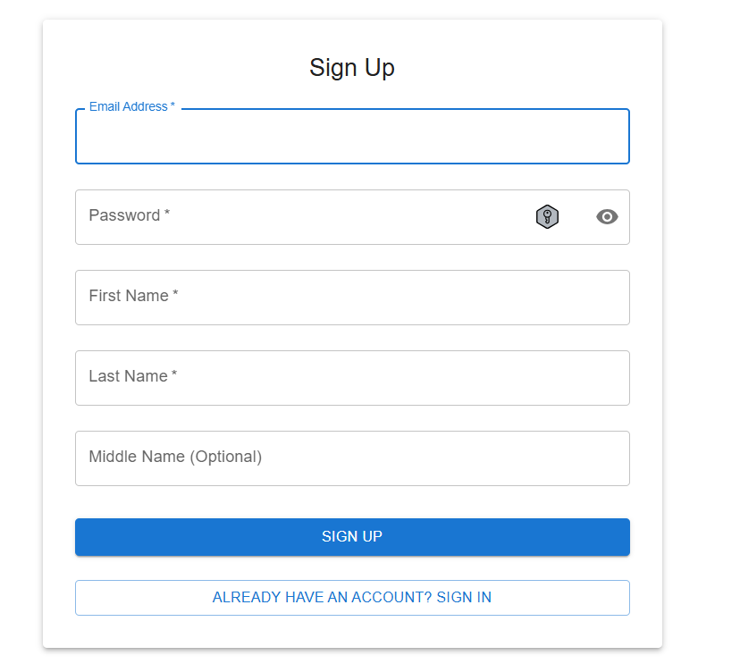

Если войти в систему как пользователь, то доступного функционала будет меньше.
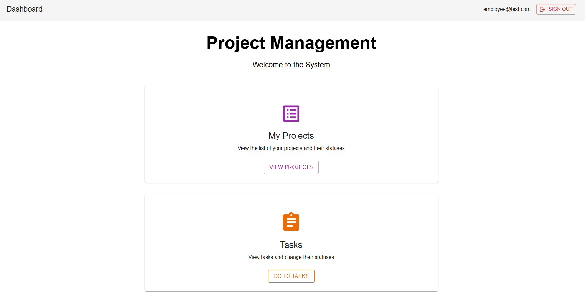

Можно только просматривать свои проекты 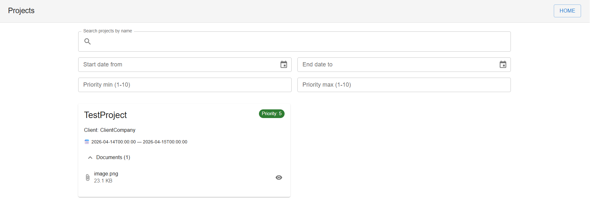 (если в проектк есть документы, то для их отображения необходимо нажать на стрелку слева от Documents)

Также можно просматривать свои задачи. Если они есть, то можно менять статус

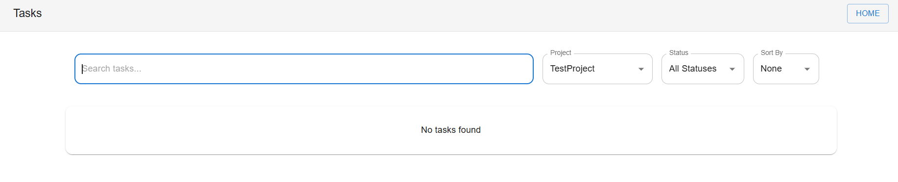

При входе в учетную запись в качестве менеджера, главная страница будет отображаться как у работника.
Можно редактировать проект, добавляя или удаляя сотрудников. Для этого нужно нажать на кнопку Edit в карточке проекта
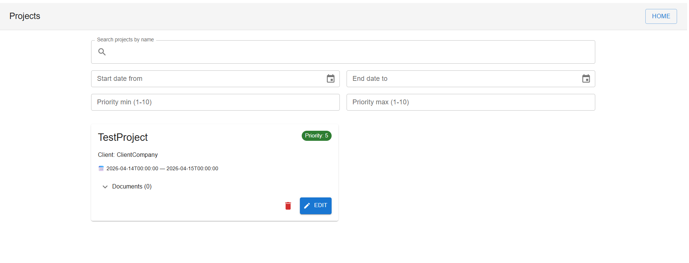

После редактирования нажать на кнопку UpdateProject

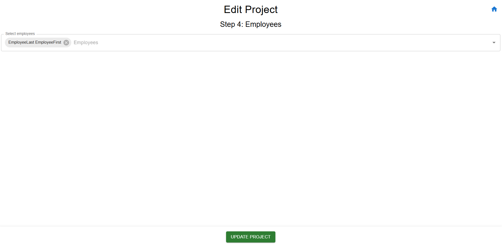

В роли менеджера можно менять статус задачам и назначать задачи другим людям. Для этого нужно изменить соответствующие настройки на карточке задачи

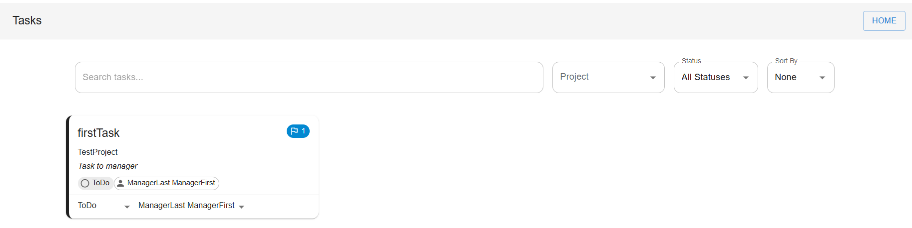